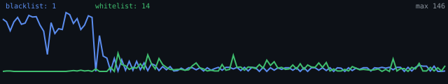

# VPN Config Parser

<p align="center">
  
  
  
  
  
</p>

<p align="center">
  <!-- Redrawn from output/stats-history.json on every run. -->
  
</p>

Fetches public VPN proxy configurations from GitHub sources, parses supported
protocol links, filters & deduplicates them, runs liveness checks (TCP/TLS/Xray
L3 probe), then publishes Happ/v2ray-compatible base64 subscriptions.

---

## Pipeline

```
fetch ──► parse ──► garbage filter ──► dedup ──► country filter
                                                │
                                                ▼
                                         aggregate ──► write ──► publish
```

1. **Fetch** -- downloads subscription files from configured GitHub repos and URLs.
2. **Parse** -- extracts proxy links (`vmess://`, `vless://`, `trojan://`, …), decodes base64 blobs.
3. **Garbage filter** -- drops malformed or obviously invalid configs.
4. **Dedup** -- removes duplicates by `(protocol, address, port, credential
   hash)`; transport fields (ws path, SNI, REALITY pbk, ...) are hashed too,
   so two accounts or two endpoints on one `address:port` both survive.
5. **Country filter** -- keeps only allowed countries, applies per-list rules.
6. **Aggregate** -- country-balanced round-robin selection caps per output.
7. **Write** -- produces base64-encoded subscription files.
8. **Publish** -- pushes outputs to a configured GitHub repository.

### Network validation

GitHub Actions runners often cannot reach VPN servers directly, so the
validator can build a small SOCKS5 proxy pool from public proxy lists and
route checks through it:

| Check | What it proves |
|-------|---------------|
| TCP | Port is open |
| TLS | TLS handshake succeeds (uses SNI / Host from config) |
| Xray L3 | Full proxied HTTPS request through the actual protocol |

Each config is tried through multiple SOCKS5 proxies before being marked
unreachable. If too few proxies are found, the search widens across
candidate lists for several rounds. Production settings use **fail-closed**
mode: weak validation publishes fewer configs instead of putting unchecked
ones back into subscriptions.

### Output files

| File | Contents |
|------|----------|
| `output/subscription.txt` | Combined pool (country-balanced, ≤`aggregator.max_configs_in_output`) |
| `output/subscription-blacklist.txt` | Blacklist pool |
| `output/subscription-whitelist.txt` | Whitelist / restricted-network pool |
| `output/subscription-mix.txt` | Halves of `aggregator.max_configs_in_output` per list (see `src/scheduler/stages/aggregate.py` `_build_mixed_output`: `max_total // 2` + remainder; override via `publisher.mix_blacklist_count` / `mix_whitelist_count`) |
| `output/subscription-clash.yaml` | Mihomo/Clash YAML twin of the combined pool |
| `output/locations/subscription-XX.txt` | Per-country subsets (≤50 per country) |
| `output/run-summary.json` | Validation metadata for Telegram notifications |
| `output/stats-history.json` | Per-run alive counts (capped history behind the trend badge and the Telegram diff-alert) |

---

## Sources

Sources are configured in [`config/sources.json`](config/sources.json).

Each source supports:

| Field | Description |
|-------|-------------|
| `type` | `url` (direct HTTPS file), `url-list` (index file listing further URLs), `subscription` (single file in a GitHub repo), `raw` (directory in a GitHub repo) |
| `list_type` | `blacklist`, `whitelist`, or `mixed` |
| `url` | Direct URL (for `url` and `url-list`) |
| `owner`, `repo`, `path`, `branch` | GitHub source location (for `subscription` / `raw`) |
| `default_country` | Fallback when country detection fails |
| `timeout` | Per-request timeout in seconds |
| `max_depth`, `include_files`, `exclude_files` | Directory crawl options (`raw`) |
| `max_files` | Cap on fetched files: crawl depth for `raw`, URLs taken from the index for `url-list` (default 200) |
| `max_concurrent_urls` | Parallel fetches of the URLs listed by a `url-list` index (default 10) |

A `url-list` source fetches an index file and then every URL inside it, so the
targets are chosen by a third party. Those fetches are SSRF-guarded and size-
capped -- see [SECURITY.md](SECURITY.md). All sources currently shipped are
`url` or `url-list`; none uses `owner`/`repo`.

### Included upstreams

- **igareck/vpn-configs-for-russia** -- Black + White lists (active; see `config/sources.json` for enabled flags)
- **luxxuria/harvester** -- Top tested configs
- **flaafix/flaafix.github.io**, **blastvpn/blastvpn-config** -- active pools
- Disabled by default (stale/dead): DarkRoyalty, V2RayRoot, sakha1370, jsxta, kort0881 url-lists, hiztin, solovyov — see `enabled:false` in `config/sources.json`
- SOCKS5 proxy pool (`validator.proxy_pool.sources` in `config/settings.yaml`): proxifly, proxyscrape, iplocate, TheSpeedX, monosans, hookzof, jetkai, ShiftyTR (VPSLab/gfpcom removed — slowed the sweep)

---

## Supported Protocols

| Protocol | Schemes |
|----------|---------|
| VMess | `vmess://` |
| VLESS | `vless://` |
| Trojan | `trojan://` |
| Shadowsocks | `ss://` |
| Hysteria2 | `hysteria2://`, `hy2://` |
| TUIC | `tuic://` |
| ShadowTLS | `shadowtls://` |
| AnyTLS | `anytls://` |

---

## Setup

```bash
# Production dependencies
pip install -e .

# Development dependencies (lint, typecheck, tests, security)
pip install -e ".[dev]"

# Optional: pre-commit hooks
pre-commit install
```

### Environment

Local `.env` files are loaded automatically when `python-dotenv` is installed.

| Variable | Description |
|----------|-------------|
| `GITHUB_TOKEN` | GitHub API token (unauthenticated rate limits are tight) |
| `GITHUB_OWNER` | Repository owner for publishing |
| `GITHUB_REPO` | Repository name for publishing |
| `GITHUB_BRANCH`| Branch for publishing *and* for the raw links in the Telegram notification (default: `main`). Both readers use this one variable, so they cannot drift apart; `update.yml` passes the repository default branch |
| `LLM_API_KEY` | Key for the provider in `llm.provider` (DashScope Qwen); fallback parsing is off by default |
| `TELEGRAM_BOT_TOKEN` | Telegram bot token for notifications |
| `TELEGRAM_CHAT_ID` | Target chat ID for notifications |
| `VALIDATOR_PROXY` | Optional SOCKS5 proxy for validation |
| `XRAY_EXECUTABLE` | Xray-core binary for the L3 probe. Relative paths resolve from the project root, bare names from `PATH`. With `xray_required: true` and no binary the liveness stage drops everything |
| `XRAY_LOCATION_ASSET` | Directory with `geoip.dat`/`geosite.dat`, read by the Xray binary itself (optional) |
| `SINGBOX_EXECUTABLE` | sing-box binary for the QUIC probe (hysteria2/tuic — Xray cannot dial them). Same resolution rules as `XRAY_EXECUTABLE` |
| `TELEGRAM_BOT_AUTHOR` | Handle credited in the notification intro (default: `@dutysissy`) |
| `VPNPARSER_PROJECT_ROOT` | Explicit project-root override for the installed `vpnparser` script (containment base for output paths) |

---

## Usage

```bash
# Run pipeline (fetch → validate → write, no publish)
python -m src.main --run

# Run and publish results
python -m src.main --run --publish

# Fast-track: re-validate the ALREADY PUBLISHED split files (minutes)
# and republish the survivors — what the hourly `41 * * * *` cron runs
python -m src.main --revalidate-published --publish

# Continuous mode (loops until interrupted, backoff on empty runs)
python -m src.main --run --continuous

# Send the Telegram report for the last run (CI calls this after publish);
# or let the pipeline itself notify (--notify works with --run/--revalidate-published)
python -m src.main --run --publish --notify
python -m src.notify.telegram --configs 50 --file output/subscription.txt

# Verbose mode
python -m src.main --run -v
```

### Tests

```bash
python -m pytest -q -p no:cacheprovider
```

---

## Configuration

Key settings in [`config/settings.yaml`](config/settings.yaml)
(full list — every key is read by `src/`, see `test_every_setting_is_read_by_src`).
The **Shipped value** column is what the repository's `settings.yaml` sets; if
you delete a key, the code fallback may differ (e.g. `proxy_attempts_per_config`
falls back to 5, `max_configs_in_output` to 500, `xray_max_alive` to 0):

| Section | Key | Shipped value | Description |
|---------|-----|---------|-------------|
| `sources` | `max_concurrent_fetches` | `10` | Concurrent fetch limit |
| `validator` | `allowed_countries` | `[]` | Global country allowlist (empty = all) |
| `validator` | `allowed_countries_by_list` | `–` | Per-list country overrides |
| `validator` | `whitelist_ru_ratio`, `whitelist_eu_countries` | `0.8` | RU/EU split in whitelist |
| `validator` | `max_configs_to_validate` | `0` | Cap on parsed configs (0 = unlimited) |
| `validator` | `tcp_enabled`, `tls_enabled`, `xray_enabled` | `true` | Liveness check toggles |
| `validator` | `tcp_timeout_seconds`, `tcp_concurrency` | `4`, `120` | TCP probe budget and parallelism |
| `validator` | `tcp_candidate_limit`, `tcp_search_rounds`, `tcp_max_alive` | `0`, `3`, `0` | TCP sweep scope (0 = unlimited / no early stop) |
| `validator` | `proxy_attempts_per_config`, `tls_proxy_attempts_per_config` | `3` | SOCKS5 proxy retries |
| `validator` | `tls_timeout_seconds`, `tls_concurrency` | `10`, `80` | TLS probe budget and parallelism |
| `validator` | `tls_verify_certificates` | `false` | Verify server certs (most VPN servers are self-signed) |
| `validator` | `xray_max_alive_by_list`, `xray_concurrency` | `300`, `24` | Xray probe limits |
| `validator` | `xray_required` | `true` | Drop everything when Xray cannot run (see `XRAY_EXECUTABLE`) |
| `validator` | `xray_timeout_seconds`, `xray_startup_timeout_seconds` | `15`, `5` | Per-URL and per-spawn timeouts |
| `validator` | `xray_attempts_per_config`, `xray_min_probe_successes` | `3`, `2` | Attempts and successes to mark alive |
| `validator` | `xray_probe_via_proxies`, `xray_proxy_probe_count`, `xray_min_proxy_successes` | `true`, `8`, `0` | Dial through the SOCKS pool |
| `validator` | `xray_stage_budget_minutes` | `45` | Wall-clock budget per list shared by all Xray/sing-box passes (candidates arriving after it get no verdict and retry first) |
| `validator` | `xray_per_config_timeout_seconds` | `120` | Hard ceiling for ONE config's whole probe (0 = off) |
| `validator` | `verification_ttl_minutes` | `180` | Recently-passed configs get one fast re-probe instead of the full attempt set (0 = off) |
| `validator` | `xray_require_distinct_outbound_ip` | `false` | Fail-closed when direct IP unknown |
| `validator` | `singbox_enabled`, `singbox_timeout_seconds`, `singbox_concurrency` | `true`, `15`, `10` | QUIC (hysteria2/tuic) L3 probe via sing-box |
| `validator` | `proxy_pool.enabled`, `proxy_pool.required` | `true`, `true` | Build a free SOCKS5 pool; fail-closed when empty |
| `validator` | `proxy_pool.min_proxies`, `proxy_pool.max_proxies` | `15`, `40` | Pool size bounds |
| `validator` | `min_alive_to_filter`, `fail_open_on_low_alive` | `10`, `false` | Low-live thresholds |
| `validator` | `geoip_enabled` | `true` | IP→country enrichment (offline `geoip_mmdb_file` first, `geoip_api_url` fallback) |
| `validator` | `geoip_requests_per_minute`, `geoip_max_lookups` | `40`, `300` | GeoIP rate limit and per-run lookup cap (extra configs keep `country=None`) |
| `aggregator` | `max_configs_in_output` | `300` | Hard cap per file (matches `xray_max_alive`) |
| `aggregator` | `max_per_country` | `200` | Per-country cap in the combined output |
| `publisher` | `output_file` | `output/subscription.txt` | Combined output path |
| `publisher` | `mix_blacklist_count`, `mix_whitelist_count` | `150`, `150` | Mix split override (default: halves of `max_configs_in_output`) |
| `publisher` | `location_output_limit` | `50` | Cap per `output/locations/subscription-XX.txt` |
| `publisher` | `min_publish_configs` | `10` | Empty-run floor: below it only metadata is published |
| `quality` | `health_history_enabled`, `health_history_file` | `true` | Per-config/source health history (local-only state; restored via the workflow cache) |
| `quality` | `health_history_retention_days`, `health_history_max_records` | `30`, `20000` | History bounds: age window AND hard record cap (still-banned records exempt) |
| `quality` | `min_consecutive_passes`, `stability_min_alive` | `2`, `10` | Publish only configs alive this many runs in a row (relaxed before it empties a list) |
| `quality` | `source_min_checked`, `source_bad_alive_rate` | `20`, `0.02` | When a source counts as persistently bad |
| `quality` | `health_ban_min_alive` | `3` | Skip bans when Xray found this few alive |
| `llm` | `enabled` | `false` | LLM fallback when regex finds no links |
| `llm` | `max_calls_per_run`, `max_calls_per_source` | `50`, `10` | Hard ceilings on paid LLM calls |

---

## GitHub Actions

[`.github/workflows/update.yml`](.github/workflows/update.yml) -- the pipeline:

- **Triggers:** full discovery run every 3 hours (`11 */3 * * *`), an hourly
  fast-track revalidation of the published set (`41 * * * *`, minutes instead
  of hours), and manual dispatch (inputs: `skip_publish`, `mode: full|fast`).
  No push trigger -- pushes are handled by `ci.yml`.
- Installs dependencies and a checksum-verified Xray-core, runs the checks and
  the test suite, executes the pipeline, publishes the subscription files, and
  sends an optional Telegram notification with a summary and a fun VPN fact.
- `skip_publish: true` runs the pipeline without `--publish` and **sends no
  notification**: nothing reaches the repository, so an "updated" message would
  advertise counts that exist only on the runner.
- Exit code 3 from `python -m src.main` means "pipeline fine, publish failed":
  the run is marked failed before the notification goes out. See
  [docs/OPERATIONS.md](docs/OPERATIONS.md#exit-codes).

[`.github/workflows/ci.yml`](.github/workflows/ci.yml) -- pull requests and
pushes to `main`:

- `lint` (ruff check + format), `typecheck` (`mypy src`), `security`
  (bandit, pip-audit, trufflehog secret scan).
- `test` matrix: Python 3.11/3.12/3.13 on `ubuntu-latest` plus 3.13 on
  `windows-latest`. The suite runs under a coverage gate
  (`--cov-fail-under` in [`pyproject.toml`](pyproject.toml)), so a branch that
  drops tests fails even when every test passes.

---

## Notes

- Output files are base64-encoded subscriptions containing newline-separated
  raw proxy links.
- Each output starts with a harmless VMess watermark entry for client
  identification.
- Fetch failures are isolated per source -- one dead upstream does not fail
  the whole run.
- Blacklist output keeps only `DE`, `FI`, `NL`, `US`, `GB`, `FR`, `JP`, `CA`.
- Whitelist is capped by `aggregator.max_configs_in_output` (300) with an 80% RU / 20% EU split (`whitelist_ru_ratio: 0.8`).
- LLM fallback ([DashScope Qwen](https://dashscope.aliyun.com)) can extract
  links from pages where regex parsing fails. Disabled by default
  (`llm.enabled: false`); the key in `LLM_API_KEY` must match `llm.provider`.
